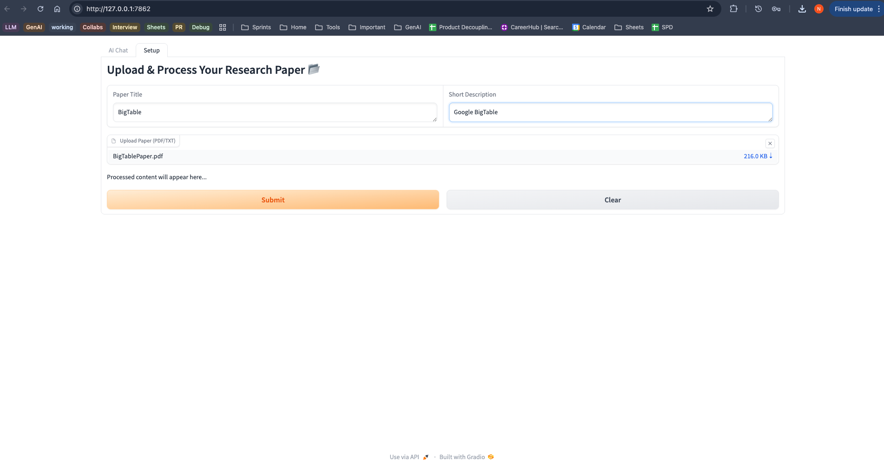
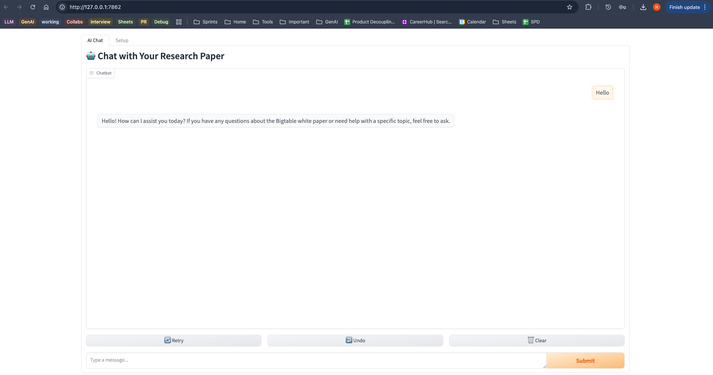

# Research Paper AI Assistant

An AI-powered application that enables users to upload, process, and interact with research papers through an intelligent chatbot interface.

## Features

- **Document Processing**: Upload and analyze research papers in PDF or TXT format
- **AI Chatbot**: Engage with your research papers using OpenAI's GPT-4o-mini powered conversations
- **Persistent Sessions**: Save and resume your research conversations with built-in session management

## Installation

1. **Clone the repository**
   ```sh
   git clone https://github.com/yourusername/research-paper-assistant.git
   cd research-paper-assistant
   ```

2. **Set up virtual environment**
   ```sh
   python3 -m venv venv
   source venv/bin/activate   # On Windows: venv\Scripts\activate
   ```

3. **Install dependencies**
   ```sh
   pip install -r requirements.txt
   ```

4. **Configure environment variables**
   
   Create a `.env` file in the `src` directory:
   ```
   OPENAI_API_KEY=your_openai_api_key
   ```

## Usage

1. **Launch the application**
   ```sh
   python src/app.py
   ```

2. **Access the interface**
   
   Open your browser and navigate to the URL provided by Gradio

3. **Process a research paper**
   - Go to the "Setup" tab
   - Enter paper metadata (title and description)
   - Upload your PDF or TXT file
   - Click "Submit" to process
   
   

4. **Interact with your paper**
   - Switch to the "AI Chat" tab
   - Ask questions and receive AI-generated insights about your paper
   
   

## Project Structure

```
research-paper-assistant/
├── src/
│   ├── app.py              # Main application logic
│   ├── session_data.json   # Persistent session storage
│   └── .env                # Environment configuration
├── statics/                # UI screenshots and assets
└── requirements.txt        # Project dependencies
```

## Requirements

- Python 3.8+
- Key dependencies:
  - Gradio (UI framework)
  - LangChain (document processing)
  - OpenAI (AI model integration)
  - See `requirements.txt` for complete list

## Known Issues

**Chat UI Display Problem**

The chat interface doesn't properly utilize the full screen width:

Current appearance:


Target appearance:


## License

This project is licensed under the MIT License. See the `LICENSE` file for details.

## Acknowledgements

- [OpenAI](https://openai.com/) for the GPT-4o-mini model
- [Gradio](https://www.gradio.app/) for the interactive UI components
- [LangChain](https://langchain.com/) for document processing capabilities

## Contributing

Contributions are welcome! Please open an issue or submit a pull request with improvements or bug fixes.
